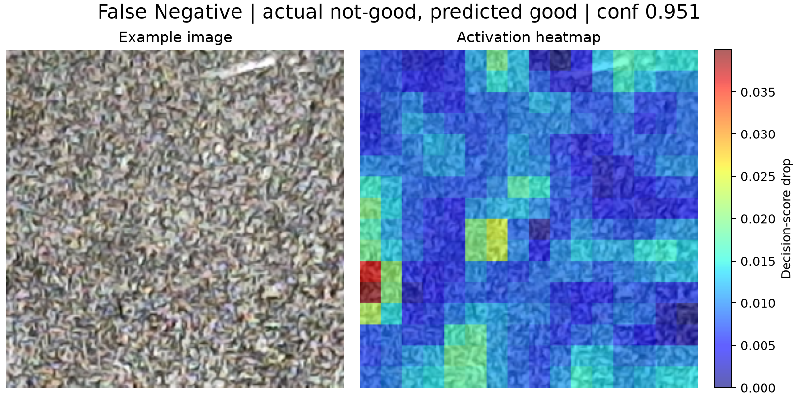
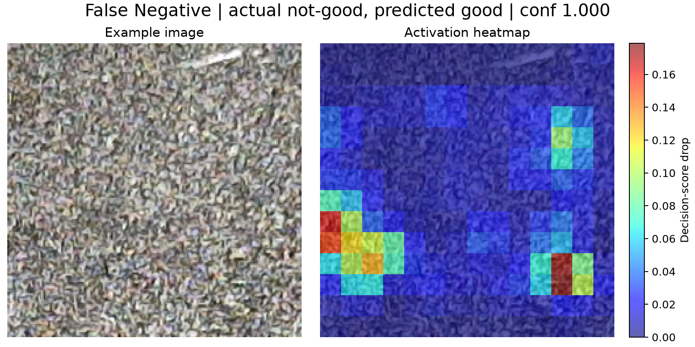
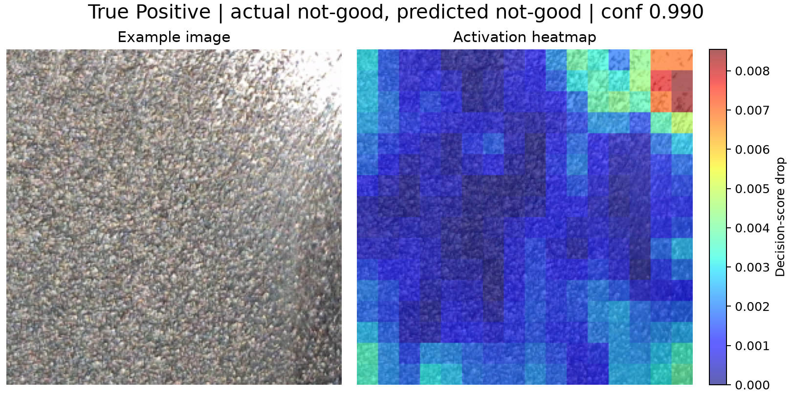
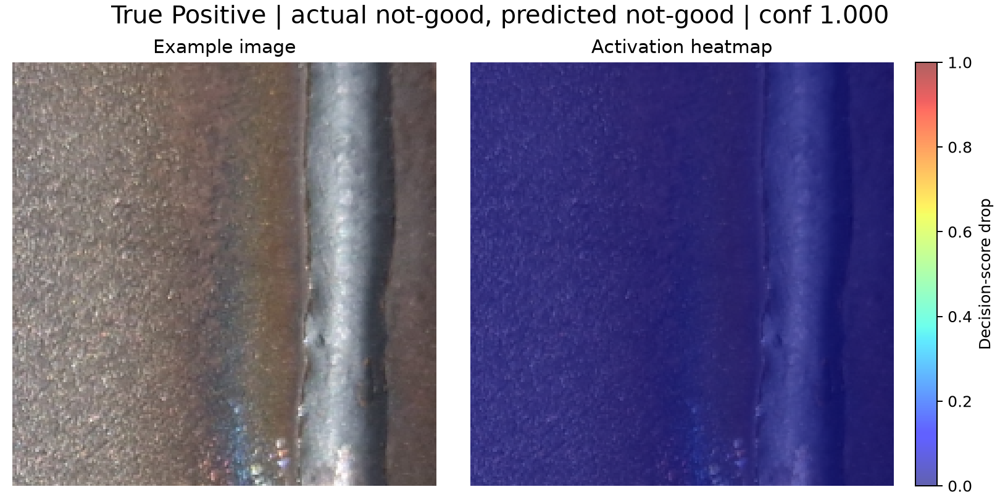
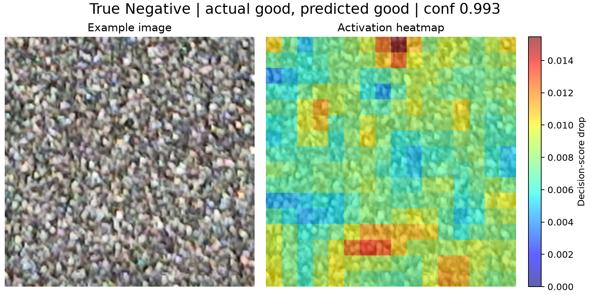
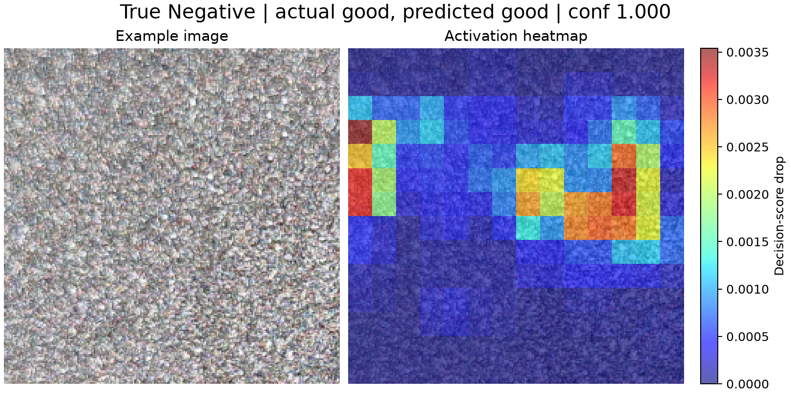
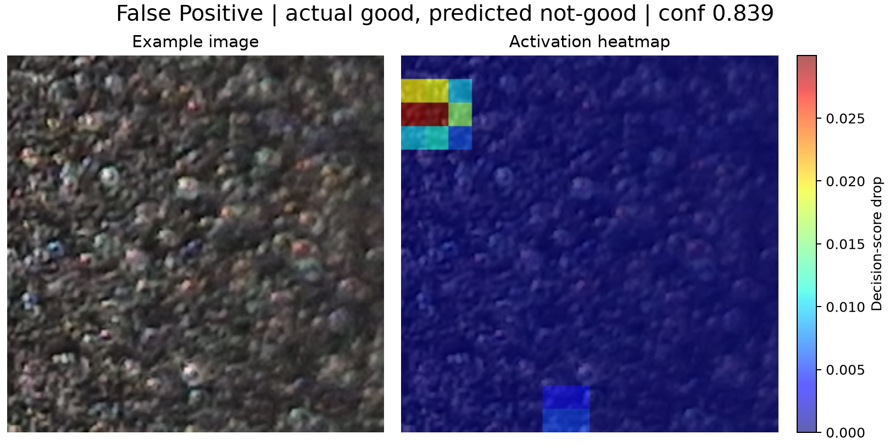
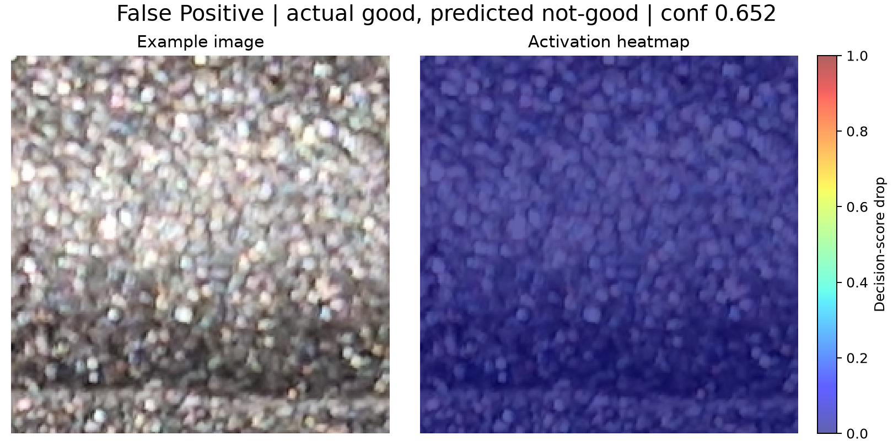

# Models comparison
## 1. Performance Comparison

| Metric | ResNet50 | SVM (GLCM+DWT) | Better |
|----------|----------:|----------:|----------|
| Accuracy | 0.9320 | **0.9360** | SVM |
| Weighted F1 | 0.9313 | **0.9361** | SVM |
| Macro F1 | 0.9301 | **0.9355** | SVM |
| Not-good Recall | 0.8571 | **0.9464** | SVM |
| Good Recall | **0.9928** | 0.9275 | ResNet50 |

### Confusion Matrices

**ResNet50**

| Actual / Predicted | Good | Not-good |
|-------------------|-----:|----------:|
| Good | 137 | 1 |
| Not-good | 16 | 96 |

**SVM (GLCM+DWT)**

| Actual / Predicted | Good | Not-good |
|-------------------|-----:|----------:|
| Good | 128 | 10 |
| Not-good | 6 | 106 |

### Interpretation

- SVM achieves slightly better overall performance across all aggregate metrics.
- ResNet50 produces fewer false alarms (1 FP vs. 10 FP).
- SVM detects substantially more defective (*not-good*) samples (106 vs. 96), reducing missed defects from 16 to 6.
- Since missed defects are typically more costly in quality-control applications, SVM provides the more favorable error profile.

---

## 2. Computational Cost

**Hardware and Testing Environment.** All experiments were conducted on a **MacBook M4** equipped with **16 GB of unified memory**.

| Metric | ResNet50 | SVM | Better |
|----------|----------:|----------:|----------|
| Preprocessing | **0.244 s** | 106.594 s | ResNet50 |
| Training + Validation | 554.146 s | **137.717 s** | SVM |
| Total Before Evaluation | 554.390 s | **244.311 s** | SVM |
| Inference (250 samples) | 8.133 s | **5.398 s** *| SVM |

* SVM inference consists of 0.0173 s classification time plus 5.3809 s feature extraction time.

### Interpretation

- ResNet50 requires substantially longer training.
- SVM incurs a high feature-extraction cost, but classification itself is nearly instantaneous.
- Overall, SVM is faster both for model development and inference.

---

## 3. Code Complexity

### Cyclomatic Complexity

Cyclomatic complexity was computed programmatically within each model's notebook using a custom Python Abstract Syntax Tree (AST)–based estimator. The analysis included the principal methods associated with each stage of the pipeline, such as preprocessing, training, validation, and inference. The estimator assigns a base complexity of 1 to each function and incrementally increases the score by counting decision points encountered while traversing the parsed syntax tree (e.g., conditional statements, loops, exception handlers, and other control-flow constructs).

| Stage | SVM | ResNet50 |
|----------|----------:|----------:|
| Preprocessing | 6 | 10 |
| Modelling & Validation | 5 | 7 |
| Evaluation | 2 | 2 |
| **Total** | **13** | **19** |

### Interpretation

- The transfer-learning pipeline is more complex (19 vs. 13 cyclomatic complexity).
- Additional complexity comes from dataset handling, augmentation, and training-control logic.
- The SVM implementation is simpler and easier to maintain, test, and deploy.

---

## 4. Bias Analysis

### Bias Under Lighting Perturbations

#### SVM (GLCM + DWT) Robustness Analysis

| Perturbation | Accuracy | Flips | Flip Rate | Good Recall | Not-Good Recall |
|-------------|----------:|------:|----------:|------------:|----------------:|
| Baseline | 0.936 | 0 | 0.000 | 0.928 | 0.946 |
| Dark (-25%) | 0.936 | 0 | 0.000 | 0.928 | 0.946 |
| Dark (-50%) | 0.936 | 0 | 0.000 | 0.928 | 0.946 |
| Offset (+10) | 0.936 | 0 | 0.000 | 0.928 | 0.946 |
| Offset (-10) | 0.932 | 3 | 0.012 | 0.920 | 0.946 |
| Low Contrast | 0.936 | 0 | 0.000 | 0.928 | 0.946 |
| High Contrast | 0.932 | 3 | 0.012 | 0.920 | 0.946 |
| Bright (+25%) | 0.940 | 5 | 0.020 | 0.942 | 0.938 |
| Bright (+50%) | 0.792 | 50 | 0.200 | 0.681 | 0.929 |

#### Transfer Learning (ResNet50 + CLAHE, clip = 0.003) Robustness Analysis

| Perturbation | Accuracy | Flips | Flip Rate | Good Recall | Not-Good Recall |
|-------------|----------:|------:|----------:|------------:|----------------:|
| Baseline | 0.928 | 0 | 0.000 | 1.000 | 0.839 |
| Dark (-25%) | 0.928 | 0 | 0.000 | 1.000 | 0.839 |
| Dark (-50%) | 0.928 | 0 | 0.000 | 1.000 | 0.839 |
| Offset (+10) | 0.916 | 3 | 0.012 | 0.993 | 0.821 |
| Offset (-10) | 0.928 | 4 | 0.016 | 0.993 | 0.848 |
| Low Contrast | 0.928 | 0 | 0.000 | 1.000 | 0.839 |
| High Contrast | 0.920 | 6 | 0.024 | 0.986 | 0.839 |
| Bright (+25%) | 0.916 | 5 | 0.020 | 0.986 | 0.830 |

#### Key Findings

- Across moderate lighting perturbations (darkening, brightening, intensity offsets, and contrast variations), the **SVM (GLCM + DWT)** model demonstrates greater stability, maintaining higher accuracy and generally exhibiting lower or comparable prediction flip rates.
- **Stress test:** Under severe overexposure (**bright_50**), **ResNet50** is substantially more robust. Although both models experience performance degradation, ResNet50 shows a smaller decline in accuracy and a considerably lower flip rate than SVM.

#### Implications for Quality Control

- **SVM (GLCM + DWT)** is the preferred choice in well-controlled steel-blast inspection environments, as it is largely insensitive to realistic lighting variations.
- **ResNet50** is more fault-tolerant when illumination conditions cannot be reliably controlled, particularly under severe overexposure.

---

### Bias Between Classes

#### ResNet50

- ResNet50 exhibits a clear bias toward the **Good** class.
- **Good recall:** 0.9928
- **Not-good recall:** 0.8571
- **Recall gap:** 0.1357, indicating a substantial imbalance in class-wise performance.
- **Interpretation:** ResNet50 is conservative when identifying defects. Consequently, it minimizes false alarms on good parts but is more likely to miss actual defective samples.

#### SVM (GLCM + DWT)

- SVM is considerably more balanced, with a slight bias toward the **Not-good** class.
- **Good recall:** 0.9275
- **Not-good recall:** 0.9464
- **Recall gap:** 0.0189, which is significantly smaller than that of ResNet50.
- **Interpretation:** SVM is more willing to flag potential defects, leading to higher defect detection rates at the cost of an increased number of false positives.

#### Practical Implications for Quality Control

- When **missing a defect is the primary risk**, **SVM (GLCM + DWT)** provides the safer bias profile because of its stronger ability to detect defective parts.
- When **false rejections are more costly than missed defects**, **ResNet50** provides the safer bias profile because it is less likely to classify good parts as defective.

---

# 5. Occlusion Sensitivity Analysis

## Quantitative Metrics

| Case | SVM Mean Confidence | SVM Mean Max Activation | ResNet50 Mean Confidence | ResNet50 Mean Max Activation |
|--------|-------------------:|-----------------------:|------------------------:|----------------------------:|
| True Positive (TP) | 0.9930 | 0.00663 | 1.0000 | 0.00000 |
| False Positive (FP) | 0.8172 | 0.05318 | 0.6525 | 0.00000 |
| False Negative (FN) | 0.7841 | 0.07051 | 0.99936 | 0.81508 |
| True Negative (TN) | 0.9904 | 0.01831 | 1.0000 | 0.06801 |

### Confidence

Confidence reflects the model's estimated probability for its predicted class.

- **SVM** clearly separates correct and incorrect predictions:
  - Correct (TP/TN): ~0.99
  - Errors (FP/FN): ~0.78–0.82

- **ResNet50** shows near-saturated confidence regardless of outcome:
  - TP/TN: ~1.00
  - FN: ~0.9994

**Interpretation:** SVM confidence is informative and well-calibrated, whereas ResNet50 remains overconfident even when wrong, making confidence less useful for error detection.

### Activation

Activation measures how strongly the prediction is affected by occlusion (i.e., the decision score drop).

- **SVM** exhibits moderately higher activation for error cases (FP/FN) than for correct predictions (TP/TN).
- **ResNet50** shows a pronounced activation increase for FNs (0.8151), far exceeding its activation in correct cases.

**Interpretation:** When ResNet50 misclassifies defective samples, its predictions appear to rely heavily on a small number of influential regions.

---

## Heatmaps Analysis

### False Negatives

The same false-negative sample was analyzed using both models.

#### SVM

### ResNet50

### Visual Observations

- Both models highlight a region in the lower-left portion of the image.
- ResNet50 produces stronger and more localized hotspots, including an additional high-importance region on the right side.
- The **SVM heatmap is more diffuse and lower in magnitude**, suggesting weaker attention to relevant defect areas.
- This may indicate that SVM under-attends to subtle or spatially localized defects in False Negative cases.

---

## True Positives

### SVM

### ResNet50

### Visual Observations

- SVM heatmaps focus on regions containing strong directional marks, bright streaks, contrast transitions, or localized texture irregularities.
- These patterns suggest that the SVM associates the *not-good* class with visible surface defects such as scratches, streaking, and non-uniform textures.
- In contrast, ResNet50 heatmaps show very low activation for True Positives, often close to zero.
- This likely results from ResNet50's near-perfect confidence: because predicted probabilities are already close to 1, occluding image regions causes minimal confidence reduction, producing near-zero activation values.

---

## True Negatives

### SVM

### ResNet50

### Visual Observations

- SVM heatmaps show diffuse and moderate activation, suggesting reliance on general background texture rather than explicit evidence of a clean surface.
- ResNet50 heatmaps are mostly low-intensity and diffuse, although some hotspot clusters appear in suspicious-looking regions.
- This suggests that ResNet50 may still attend to localized areas resembling potential defects, even when the final prediction is correct.

---

## False Positives

### SVM

### ResNet50

### Visual Observations

- SVM heatmaps show very low maximum activation and often focus on small corner or edge regions.
- This suggests that some good samples may be incorrectly classified as *not-good* due to minor localized artifacts, boundary effects, lighting variations, or texture anomalies.
- ResNet50's heatmap exhibits near-zero activation across the entire image, accompanied by low prediction confidence.
- This suggests a boundary-case misclassification driven by diffuse model bias rather than evidence of a distinct, localized defect.

---

## Overall Interpretation

The occlusion sensitivity analysis reveals clear differences between the models.

The **SVM** is better calibrated, with confidence decreasing substantially on incorrect predictions. Its heatmaps are often more interpretable, particularly when activations align with visible defects such as scratches, streaks, and localized texture irregularities. However, it may miss subtle defects (False Negatives) or misclassify artifacts and lighting variations as defects (False Positives).

In contrast, **ResNet50** remains highly confident even when incorrect, limiting the usefulness of its confidence scores for error detection. While its heatmaps can be less informative due to confidence saturation, some False Negative cases exhibit strong, highly localized activations, suggesting reliance on a small number of influential image regions.

## Implications for Quality Control

SVM heatmaps provide more interpretable occlusion sensitivity heatmaps. Activations often corresponded to visually meaningful surface defects, such as scratches, streaks, and localized texture irregularities. This transparency is critical in industrial settings because inspectors must be able to verify that the model is basing its decisions on genuine surface conditions rather than irrelevant image features. 

# 6. Deployment Considerations

## Architecture

- The ML pipeline is deployed on **AWS SageMaker**.
- A **SageMaker Real-Time Endpoint** serves the model and accepts raw images as input.
- The inference service bundles **image preprocessing and model inference** in a single deployment artifact, ensuring consistency between training and production environments.
- **Amazon S3** is used to store:
  - Training and test datasets
  - Model artifacts
  - Supporting assets and metadata
- **SageMaker Model Registry** manages model versions, approval workflows, and deployment readiness.

---

### Observability

#### Prometheus and Grafana

Prometheus and Grafana provide production-grade monitoring and visualization capabilities:

- Track inference latency, throughput, and resource utilization.
- Monitor prediction distributions and class-specific error metrics (e.g., false positives and false negatives).
- Log requests, predictions, and operational metrics for troubleshooting and quality assurance.
- Configure alerts for abnormal system behavior, performance degradation, and potential model drift.

---

### Security

#### AWS API Gateway

AWS API Gateway acts as the secure entry point to the ML inference service:

- Enforces HTTPS communication between clients and the ML pipeline.
- Applies rate-limiting and throttling policies to prevent abuse and maintain system stability.
- Validates and sanitizes incoming requests, including checks on image format, resolution, and payload size.
- Supports authentication and authorization mechanisms and can be integrated with additional security controls such as AWS WAF.

---

## Design Justification

- AWS API Gateway

AWS API Gateway is a fully managed service that provides secure API exposure, request validation, authentication, and rate limiting, helping protect the inference service while ensuring reliable access.

- Bundled Preprocessing and Inference

Combining preprocessing and inference into a single deployment ensures that the same transformations used during training are consistently applied during production inference, eliminating training-serving skew and improving prediction reliability.

- AWS SageMaker

AWS SageMaker provides a managed environment for model hosting, deployment, auto-scaling, and monitoring, reducing infrastructure management overhead and simplifying production operations.

- Amazon S3

Amazon S3 offers highly durable, scalable, and cost-effective storage for datasets, model artifacts, and deployment assets.

- SageMaker Model Registry

SageMaker Model Registry supports model lifecycle management through version control, approval workflows, traceability, and controlled promotion of models from development to production.

- Prometheus and Grafana

Prometheus and Grafana deliver flexible, enterprise-grade observability capabilities, enabling real-time monitoring of application performance, inference metrics, and model behavior through dashboards and alerting mechanisms.

---

## Diagram

## Note on Transfer Learning vs. Classical SVM

The proposed deployment architecture is compatible with both the classical **SVM-based approach** and the **transfer learning vision model (ResNet50)**. However, it is better suited to the transfer learning approach, as deep learning models benefit significantly from features provided by AWS SageMaker, including GPU-accelerated training, managed inference endpoints, model versioning, and scalable deployment.

For a classical SVM model, which is typically lightweight and CPU-based, the SageMaker hosting layer may introduce unnecessary cost and operational complexity. In such cases, a simpler architecture based on **Amazon ECS/Fargate with a FastAPI service** can provide a more cost-effective and streamlined solution while still supporting reliable model serving and monitoring.

# 7. Ethical Analysis

## Algorithmic Fairness

In steelblast quality control, fairness concerns both product classes and downstream stakeholders, including customers, operators, production planners, and safety teams.

- **ResNet50 favors the Good class**
  - Very low false positives (fewer good parts rejected)
  - Higher false negatives (more defects missed)

- **SVM is more defect-sensitive**
  - Higher false positives (more good parts flagged)
  - Lower false negatives (fewer defects escape)

**Fairness trade-off**
- **ResNet50:** Fairer toward production efficiency and throughput.
- **SVM:** Fairer toward product safety and customer protection.

## Real-World Consequences of False Positives and False Negatives

### False Negative (Defect → Good)
A defective part is incorrectly accepted.

**Potential consequences:**
- Product failures
- Warranty claims
- Recalls
- Reputational damage
- Safety and compliance risks

### False Positive (Good → Defect)
A good part is incorrectly flagged as defective.

**Potential consequences:**
- Unnecessary rework or scrap
- Increased manual inspection
- Higher operational costs
- Reduced throughput

In most steelblast applications, **false negatives are significantly more harmful than false positives**, making high defect recall a critical requirement.

## Bias and Harm Risks

### Environmental Bias (Lighting and Imaging)

- SVM remains stable under moderate lighting variations but degrades under severe overexposure.
- Variations in lighting, camera settings, or shifts can introduce line-, shift-, or camera-specific bias, causing predictions to depend on image acquisition conditions rather than actual part quality.

### Confidence-Related Decision Harm

- ResNet50 can be highly confident even when incorrect.
- If confidence scores are used to trigger manual review, overconfident errors may bypass safety checks and suppress human intervention, increasing the risk of undetected defects.

### Prediction Sensitivity

- SVM may misinterpret image artifacts, edge patterns, or lighting irregularities as defects.
- This can increase false positives and disproportionately affect production lines with noisier imaging conditions.

## Governance Controls to Reduce Harm

### Risk-Based Decision Workflow

- Use **SVM as the primary defect detector** due to its stronger defect recall.
- Route **positive or uncertain predictions** to a secondary review process (human inspector or backup model) to reduce unnecessary scrap and improve decision reliability.

### Lighting and Exposure Controls

- Enforce standardized illumination procedures (SOPs) and automated exposure checks during image acquisition.
- Redirect overexposed or low-quality images to fallback handling, such as image re-capture, manual review, or a secondary model.

### Bias and Performance Monitoring

- Monitor model performance using **per-shift** and **per-camera** confusion matrices.
- Track recall and error-rate differences between **Good** and **Not-good** classes over time.
- Investigate performance drift to identify emerging lighting, equipment, or operational biases.

# 8. Overall Assessment

Recommended primary model for real-world deployment: SVM (GLCM + DWT)

## Justification:
1.	Better overall metrics and class balance
2.	Much lower false negatives (better defect containment)
3.	More informative confidence behavior for operational decision thresholds
4.	More robust across moderate lighting perturbation
5.	Lower complexity and compute burden, improving maintainability and reproducibility

This recommendation is ethically justified when the plant’s principal duty is to minimize defect escape risk.

